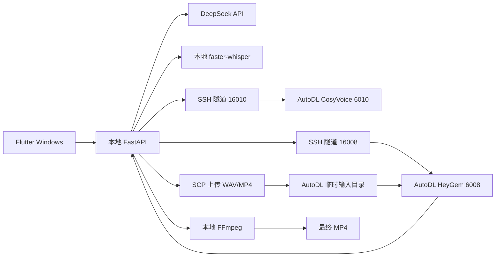

# 数字人生成技术架构

更新时间：2026-06-21

## 1. 目标

输入：

- 口播文案
- 用户授权的声音参考
- 用户上传的真人静默视频

输出：

- 使用克隆声音
- 嘴部开合与语音基本同步
- 保留原人物、动作、服装和背景
- 带字幕和背景音乐的 H.264/AAC MP4

本项目不生成人物、不做图生视频，只修改真人视频口型。

## 2. 当前部署拓扑



## 3. 组件职责

### Flutter

- 创建和管理任务
- 上传声音、数字人视频和 BGM
- 编辑文案、字幕和生成选项
- 展示进度并预览结果

### 本地 FastAPI

- 任务编排和文件管理
- 抖音视频导入
- ASR、DeepSeek、CosyVoice、HeyGem Provider 调度
- 视频时长匹配
- 字幕、BGM、封面和最终渲染

### DeepSeek

- 使用远程 API 仿写文案
- 模型配置为 `deepseek-v4-flash`
- 输出层统一去除中英文标点

### CosyVoice

- 模型：CosyVoice-300M-25Hz
- 运行位置：AutoDL RTX 4090D
- API：`POST /api/voice`
- 输入：文案和 16 kHz WAV 参考声音
- 输出：22.05 kHz PCM WAV
- 长文本必须拼接全部 `tts_speech` 输出块

### HeyGem

- 运行位置：AutoDL RTX 4090D
- 输入：静默真人视频和克隆 WAV
- 输出：已驱动口型的视频
- 使用队列接口，不自动回退其他数字人引擎

### FFmpeg

- 匹配视频和声音时长
- 替换主音轨
- 添加背景音乐
- 烧录字幕
- 输出最终 MP4

## 4. 端到端数据流

```text
1. 导入视频
2. faster-whisper 提取原文
3. DeepSeek 仿写并去标点
4. 上传参考声音到 AutoDL CosyVoice
5. 下载完整克隆 WAV
6. 本地将数字人视频匹配到音频时长
7. SCP 上传视频和 WAV 到 AutoDL
8. HeyGem /api/jobs/local 创建任务
9. 轮询任务并下载口型视频
10. 本地生成字幕、混入 BGM、输出 MP4
```

## 5. 为什么使用 SCP

AutoDL 公网入口可能重置长时间没有响应数据的 HTTP 请求。1080×1920 视频通过 multipart 上传时，服务端已经接收并生成成功，但本地连接约 120 秒被强制关闭。

SCP 传输有持续的数据流和独立的 SSH 连接。文件到达 AutoDL 后，`/api/jobs/local` 只提交短小的路径参数，能够立即返回 `job_id`。

## 6. 已验证性能

当前性能只用于确认架构有效，不作为优化目标：

| 阶段 | 实测 |
|---|---:|
| CosyVoice 三行固定文案 | 约 4.8–5.7 秒 |
| HeyGem 官方 6 秒示例 | 约 30.6 秒 |
| HeyGem 13.76 秒真实任务 | 约 60.66 秒 |
| 真实任务重试端到端 | 约 69.9 秒 |

## 7. 故障处理

### CosyVoice 文本尾部丢失

禁止使用：

```python
next(model.inference_cross_lingual(...))
```

必须遍历生成器并拼接所有音频块。

### HeyGem 显示服务不可用但云端任务成功

检查是否仍在使用 multipart HTTP 上传。如果云端 `/api/jobs` 能看到成功任务，而本地报告连接重置，应启用 `HEYGEM_SSH_*` 配置。

### CUDA 803 或 GPU 不可用

检查镜像加载的 `libcuda.so` 是否与 AutoDL 宿主驱动一致，并使用当前实例的 580.76.05 库。

## 8. 安全边界

- GPU API 只监听 AutoDL 回环地址。
- 本地通过 SSH 隧道访问。
- 大文件通过 SSH 密钥传输。
- `.env` 不提交 Git。
- 不在文档中记录密码、API Key 或私钥内容。

## 9. 后续架构

优先升级：

1. 同步 render 改为后台任务和状态机。
2. 保存云端 `job_id`，支持取消和恢复。
3. 任务完成后清理 SCP 输入目录。
4. 使用内容哈希避免重复上传相同数字人模板。
5. 使用逐字时间戳生成精确字幕。
6. SQLite 替代 JSON 持久化。

## 10. 许可

HeyGem/Duix 使用自定义社区许可。采用该技术并不等于自动获得商业 SaaS、闭源分发或模型权重再分发许可，正式上线前必须完成法律和授权确认。
