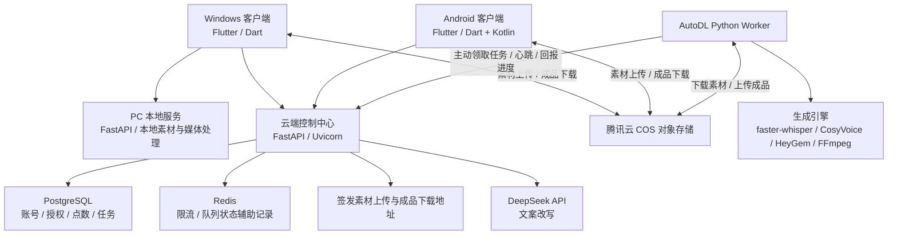

# 智能口播智能体：PC 与安卓技术架构

> 根据本地仓库代码与部署配置整理，仅涵盖 Windows PC 和 Android。PC 以 `pc` 为准，安卓以较新的 `Android` 为准。本文描述代码实现与部署方案，不代表已核验线上服务的实时运行状态。

## 1. 整体架构

项目采用 **Flutter 双端客户端 + Python FastAPI 后端 + 云端任务控制中心 + AutoDL GPU 生成服务** 的架构。

- **PC 端**：Flutter Windows 桌面应用，配套本地 FastAPI，默认采用云端生成，也保留本地处理链路。
- **安卓端**：Flutter Android 应用，直接访问云端 API，手机负责交互、素材选择、预览和保存，生成计算交给云端。
- **两端共用**：账号、点数、任务调度、对象存储，以及语音识别、文案改写、声音克隆、数字人视频生成能力。



上图展示默认云端生成路径。云端控制中心负责业务与调度，AutoDL 负责耗时的模型推理和视频生成；大文件通过 COS 传输。

## 2. PC 分支：Windows 桌面端

**分支：`pc`**

### 客户端技术

| 技术 | 用途 |
|---|---|
| Flutter + Dart | 桌面界面、创作工作台、任务与素材管理 |
| Material 3 | 界面组件与主题 |
| StatefulWidget + setState | 页面状态管理 |
| http | 调用本地及云端 REST API |
| file_picker | 选择视频、参考声音、背景音乐等素材 |
| path_provider | 获取本地应用数据与缓存目录 |
| media_kit + media_kit_video | 音频试听与视频预览 |
| Windows Runner / CMake | Windows 原生宿主与构建 |

### 本地服务

PC 配套 `services/api` 中的 **Python + FastAPI + Uvicorn** 服务，通过本机 HTTP 与 Flutter 通信。

主要职责包括本地素材管理、视频导入、文案处理、媒体预处理、字幕与视频合成，以及桌面发布相关功能。抖音视频导入使用 Playwright 等工具；媒体处理使用 FFmpeg；语音识别、文案改写、声音生成等能力通过 Provider 接口按配置选择实现。

本地任务与素材元数据采用 **JSON 文件** 持久化，视频、音频、字幕和成品保存在本地文件目录中。Python 依赖使用 **uv** 管理。

### 运行与交付

- Flutter 客户端可自动启动打包附带的本地 API 程序。
- Python 后端通过 **PyInstaller** 打包，与 Windows 客户端一起分发。
- 默认生成模式为云端：上传素材、提交任务、轮询进度并下载成品。
- 本地生成链路仍保留，实际依赖的模型和服务由运行配置决定。
- PC 的授权流程包含软件激活，以及云端账号登录和点数管理。

## 3. 安卓分支：Android 移动端

**分支：`Android`**

### 客户端技术

安卓与 PC 共享 Flutter/Dart 代码基础，通过平台判断和移动端页面适配形成不同交互。移动端界面主要位于 `apps/client/lib/mobile.dart`。

| 技术 | 用途 |
|---|---|
| Flutter + Dart | 移动端创作、账号、素材和任务界面 |
| http | 直接调用云端 API，上传素材、下载结果 |
| media_kit | 音视频预览与试听 |
| file_picker + path_provider | 素材选择、本地缓存与成品文件管理 |
| Kotlin + MethodChannel | Flutter 与 Android 原生能力通信 |
| MediaStore | 将生成视频保存到手机相册 |
| Android Keystore + AES-GCM | 加密保存登录相关令牌 |
| package_info_plus + 原生安装接口 | 版本信息读取及 APK 更新安装 |
| Gradle + 签名配置 | Android APK 构建与发布签名 |

### 运行方式

安卓采用 **直接连接云端的客户端架构**，不在手机上运行 Python 后端或 GPU 模型。

```text
注册 / 登录账号
  → 输入文案或选择素材
  → 云端文案处理与声音生成
  → 上传形象视频、声音、BGM 等素材
  → 提交数字人生成任务
  → 轮询任务进度
  → 下载并预览 MP4
  → 保存到手机相册
```

该分支的手机端无需激活码，使用账号登录和云端点数体系，并包含内置 BGM、自定义封面文字等移动端功能。

## 4. 两端共用的后端与 AI 能力

### 云端控制中心

代码位于 `services/cloud`，部署方案使用腾讯云服务器承载业务服务。

| 组件 | 作用 |
|---|---|
| FastAPI + Uvicorn + Pydantic | 提供接口、数据校验与业务逻辑 |
| PostgreSQL | 持久化用户、设备授权、点数和任务等数据 |
| SQLite | 未配置 PostgreSQL 连接时的本地数据库后备方案 |
| Redis | 接口限流、队列状态辅助记录；任务持久化仍由数据库负责 |
| 腾讯云 COS | 保存输入素材、参考音频和生成结果，提供签名上传/下载地址 |
| Python Scheduler | 执行任务巡检、超时及过期资源清理 |
| Docker Compose + Nginx | 服务编排与 API 反向代理 |

客户端通过 API 访问业务能力，数据库与 Redis 由服务端管理。AutoDL Worker 主动向控制中心领取任务，并上报心跳、进度与结果。

### AI 与视频处理链路

| 环节 | 技术 | 职责 |
|---|---|---|
| 语音识别 | faster-whisper | 将源视频或音频转换为文案 |
| 文案改写 | DeepSeek API | 仿写、润色和口播脚本生成 |
| 声音克隆 / TTS | CosyVoice | 根据文案与参考声音生成配音 |
| 数字人口型 | HeyGem | 根据人物视频和配音生成口型视频 |
| 媒体处理 | FFmpeg | 音视频预处理、字幕、BGM、封面及 MP4 合成 |
| 任务执行 | AutoDL GPU + Python Worker | 拉取素材、组织生成流程、上传结果并回报状态 |

完整生成链路可概括为：

```text
源视频 / 用户文案
  → 语音识别（按需）
  → DeepSeek 文案改写（按需）
  → CosyVoice 配音
  → HeyGem 数字人口型
  → FFmpeg 字幕、BGM 与成片合成
  → COS 保存结果
  → PC / 安卓下载与播放
```

## 5. PC 与安卓的主要区别

| 对比项 | PC（Windows） | 安卓（Android） |
|---|---|---|
| UI 技术 | Flutter / Dart | Flutter / Dart |
| 平台适配 | Windows 原生宿主 | Kotlin + MethodChannel |
| 本地 Python 服务 | 配套 FastAPI，可随客户端启动 | 无 |
| 生成模式 | 默认云端，保留本地链路 | 云端生成 |
| 软件入口 | 软件激活 + 云端账号 | 无激活码，注册 / 登录账号 |
| 素材与成品 | 本地文件目录 + 云端 COS | 应用目录 / 手机相册 + 云端 COS |
| 发布形式 | Windows 客户端及配套 API 程序 | 签名 APK |
| 主要定位 | 桌面创作与素材管理工作台 | 移动创作、任务查看及成品保存 |
